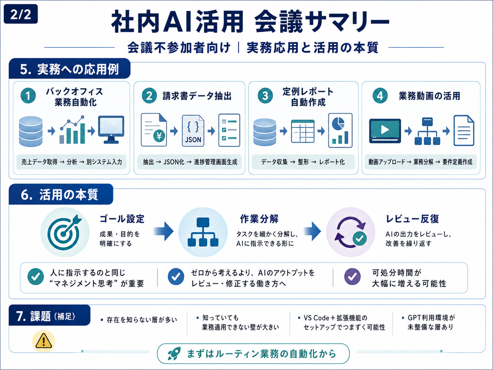

# 文字でも音声でもない。イラストを勉強する時代

こんにちは。株式会社SHIFTの能力開発部で検定や教育制度を開発をしている林 稔明（りんりん）です！ 日々、社員のみなさんの能力・スキルをどう伸ばせば現場で活躍できる人材になるのか、業務や作業を分解したり、人の行動について考えたりしています。

皆さんは、何かを学ぶとき、文字で読む派でしょうか。音声で聞く派でしょうか。

私は最近、そこにもう一つの選択肢が入ってくるのではないかと感じています。それが、イラストで学ぶという方法です。
小説はなかなか読めないけれど、漫画なら読める。音声で聞いても右から左に流れてしまうけれど、図やイラストなら何度も視線を戻せる。

こうした経験は、多くの人にあるのではないでしょうか。

AIによって文章や音声の生成が簡単になっただけでなく、イラストや図解の生成もかなり身近になってきました。
だからこそ、これからは「文字を読む」「音声で聞く」だけでなく、「イラストで理解する」ことが重要になっていくのではないかと思っています。

## 文字とイラストは、同じ視覚情報でも役割が違う

文字もイラストも、目で見る情報です。しかし、脳に入ってくる情報の性質はかなり違います。
文字は、基本的に順番に処理していく情報です。一文を読み、次の文を読み、前後の関係を頭の中で組み立てて理解していきます。

一方で、イラストや図解は、配置、色、形、距離、矢印、まとまりといった情報を同時に受け取れます。
つまり、イラストは内容を伝えるだけでなく、関係性や構造を見せることができるのです。

たとえば、生成AIの仕組みを文字だけで説明しようとすると、「大量のデータをもとに、入力された文脈から次に来る可能性の高い情報を推定し、出力を生成する」のような説明になります。

もちろん、間違いではありません。ただ、初めて聞く人には少し分かりにくい。これをイラストにすると、入力、モデル、出力、学習データ、フィードバックの関係を一枚で見せることができます。理解の入口としては、イラストの方が向いている場面があるのです。

## AI時代は、情報量が多すぎる

AI時代の問題は、情報が足りないことではありません。むしろ、情報が多すぎることです。
検索すれば情報が出てくる。AIに聞けば要約もしてくれる。動画も音声も記事も無限にあります。

しかし、情報が増えれば増えるほど、「結局何を理解すればよいのか」が見えにくくなります。
だからこそ、これから重要になるのは、情報を増やすことではなく、見える形に整理することです。

イラスト化は、そのための有効な手段です。文字情報をただ読むのではなく、構造として見る。
関係性を視覚で捉える。全体像と細部を行き来する。

これができると、理解のスピードも深さも変わります。

## イラストは、思考の整理を助ける

イラストの価値は、分かりやすく見せることだけではありません。作る側の思考も整理してくれます。
なぜなら、イラストにするためには、何を中心に置くのか、何を省くのか、何と何をつなぐのかを決める必要があるからです。

文字であれば、多少あいまいなままでも書けてしまいます。しかし、イラストにすると、構造の曖昧さが表に出ます。
どれが原因で、どれが結果なのか。どの要素が並列で、どの要素が階層なのか。何を大きく見せ、何を小さく扱うのか。

こうした判断をしなければ、イラストは作れません。つまり、イラスト化はアウトプットであると同時に、思考の検査でもあるのです。

## ただ画像にすればよいわけではない

ここで注意したいのは、何でも画像化すればよいわけではないということです。
AIを使えば、雰囲気のある画像や図解は簡単に作れます。

しかし、目的が曖昧なまま画像化すると、逆に分かりにくくなることがあります。
よくある失敗は、次のようなものです。

- 文字情報をそのまま画像の中に並べただけ
- イラストが多すぎて、どこを見ればよいか分からない
- 雰囲気はきれいだが、理解にはつながらない
- 色や装飾が多く、重要な情報が埋もれる
- 何を伝えたい一枚なのか分からない

これは、資料作成でも同じです。
きれいなスライドと、分かるスライドは違います。
きれいなイラストと、理解を助けるイラストも違います。

## イラストにも魂を込める必要がある

イラスト化で大事なのは、「この一枚で何を伝えたいのか」を決めることです。
ここでも、以前お伝えした「魂を込める」という考え方が重要になります。

魂とは、単に熱量を入れることではありません。
目的を決めることです。読者に何を理解してほしいのか。何に気づいてほしいのか。どの関係性を見えるようにしたいのか。どの情報をあえて捨てるのか。

この判断がないまま画像を作ると、AIはそれっぽいものを作ってくれます。しかし、それは理解のためのイラストではなく、雰囲気のためのイラストになってしまいます。

## AIを使ったイラスト学習の始め方

AI時代にイラストで学ぶなら、まずは難しく考えず、次のように使ってみるとよいと思います。

1. 学びたいテーマを決める
   - 例: 生成AIの仕組み、半導体のサプライチェーン、KPI分解、営業プロセス。

2. 文字で要点を整理する
   - いきなり画像化せず、まず何を理解したいのかを書く。

3. 1枚で伝えたいことを決める
   - 全部ではなく、今回伝えたい関係性を1つに絞る。

4. AIに図解やイラスト化させる
   - Flipbook Pageのような視覚探索ツールや、画像生成AIを使ってみる。

5. 出てきた画像を見て、理解が進むか確認する
   - きれいかどうかではなく、分かるかどうかを見る。

この流れで使うと、AIは単なる画像生成ツールではなく、学習を助ける思考支援ツールになります。

## まとめ

これからの学び方は、文字を読む、音声で聞く、動画を見るだけではなく、イラストで理解する方向にも広がっていくと思います。
特にAI時代は、情報量が多すぎます。その中で大事なのは、情報を増やすことではなく、構造として見えるようにすることです。

イラストは、色、形、配置、関係性を使って、理解を助けてくれます。ただし、画像化すればよいわけではありません。
本当に必要なのは、その一枚で何を伝えたいのかを考えることです。次にくるのは文字でも音声でもない、イラストで学ぶ時代です。

それは、AIが画像を作れるようになったから始まるのではなく、私たちが情報をどう理解し、どう整理するかを改めて考える時代なのだと思います。
